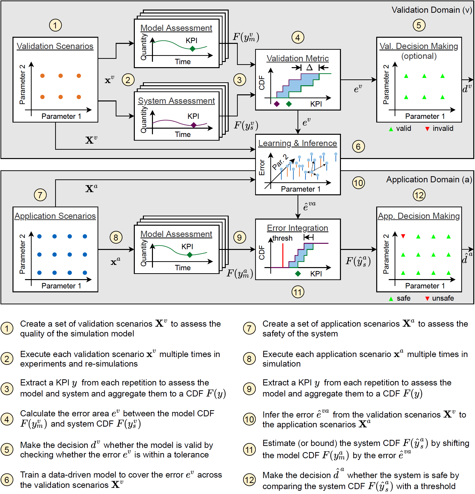

# VVUQ Framework



This framework provides methods and tools to assure the quality of computer simulations. They primarily belong to the field of model verification, model validation, and uncertainty quantification (VVUQ). Great emphasis is placed on quantifying model errors and uncertainties and then accounting for them during the actual model predictions. The framework is structured as a clear process with several steps. Each step has a clear interface and several interchangeable configuration options. The framework is written in Python, while the entire configuration is outsourced in separate config files to ensure usability without detailed code knowledge. Ultimately, the user can generate multiple diagrams for visualization and measures to judge the model quality.

Working with this framework means fully configuring everything at the start, executing the main script so that the automation runs from start to finish, and retrieving the results and visualizations. It is not intended as an interactive GUI tool, where the user would manually go through the VVUQ steps and play with each block configuration separately until the result is deemed suitable. Nevertheless, the user configuration is supported by web-based forms.

### Disclaimer
This software comes from a single PhD thesis and is provided as is. Therefore, the primary purpose of the software was to provide all functionalities required to pursue the research and the corresponding publications. Nevertheless, the software was designed with the thought in mind that it might be further developed and used by someone else in the future. The code has a modular architecture and extensive documentation in the code files. However, due to limited time and human resources, this code has not been subjected to extensive testing as in larger projects. In case the software will be further developed, there might be breaking changes in the config files, component interfaces, or function signatures.

### Documentation
The documentation of the framework can be found in the doc folder and is hosted [here](https://vvuq-python-framework.readthedocs.io/en/latest/).

### Contact
[Stefan Riedmaier](mailto:stefan.riedmaier@tum.de).

### Publications
This framework is connected to several publications. If you find this work useful, please consider citing the respective publication. The citations and the bibtex code is provided below.

The main theorethical foundations were layed in the first paper. The second paper contains a validation of the framework itself by comparing two simulations with injected faults. In the thrid paper we apply the framework to the safeguarding of an automated vehicle. The bigger picture with all the context can be found in the dissertation itself.

[Riedmaier.2021a] S. Riedmaier, B. Danquah, B. Schick and F. Diermeyer, "Unified Framework and Survey for Model Verification, Validation and Uncertainty Quantification," Archives of Computational Methods in Engineering, vol. 28, pp. 2655-2688, 2021.

[Riedmaier.2021b] S. Riedmaier, J. Schneider, B. Danquah, B. Schick and F. Diermeyer, "Non-deterministic model validation methodology for simulation-based safety assessment of automated vehicles," Simulation Modelling Practice and Theory, vol. 109, pp. 1-19, 2021.

[Riedmaier.2021c] S. Riedmaier, D. Schneider, D. Watzenig, F. Diermeyer and B. Schick, "Model Validation and Scenario Selection for Virtual-Based Homologation of Automated Vehicles," Applied Sciences, vol. 11, pp. 1–24, 2021.

[Riedmaier.2022] S. Riedmaier, "Model Validation and Uncertainty Aggregation for Safety Assessment of Automated Vehicles," PhD thesis, Technical University of Munich, Munich, 2022

```
   @article{Riedmaier.2021a,
    author = {Riedmaier, Stefan and Danquah, Benedikt and Schick, Bernhard and Diermeyer, Frank},
    year = {2021},
    title = {Unified Framework and Survey for Model Verification, Validation and Uncertainty Quantification},
    journal = {Archives of Computational Methods in Engineering},
    pages = {2655–-2688},
    volume = {28}
   }

   @article{Riedmaier.2021b,
    author = {Riedmaier, Stefan and Schneider, Jakob and Danquah, Benedikt and Schick, Bernhard and Diermeyer, Frank},
    year = {2021},
    title = {Non-deterministic model validation methodology for simulation-based safety assessment of automated vehicles},
    journal = {Simulation Modelling Practice and Theory},
    volume = {109},
    pages = {1--19}
   }

   @article{Riedmaier.2021c,
    author = {Riedmaier, Stefan and Schneider, Daniel and Watzenig, Daniel and Diermeyer, Frank and Schick, Bernhard},
    year = {2021},
    title = {Model Validation and Scenario Selection for Virtual-Based Homologation of Automated Vehicles},
    journal = {Applied Sciences},
    volume = {11},
    pages = {1--24}
   }

   @phdthesis{Riedmaier.2022,
    author = {Riedmaier, Stefan},
    year = {2022},
    title = {Model Validation and Uncertainty Aggregation for Safety Assessment of Automated Vehicles},
    address = {Munich, Germany},
    school = {{Technical University of Munich}},
    type = {Dissertation}
   }
```
