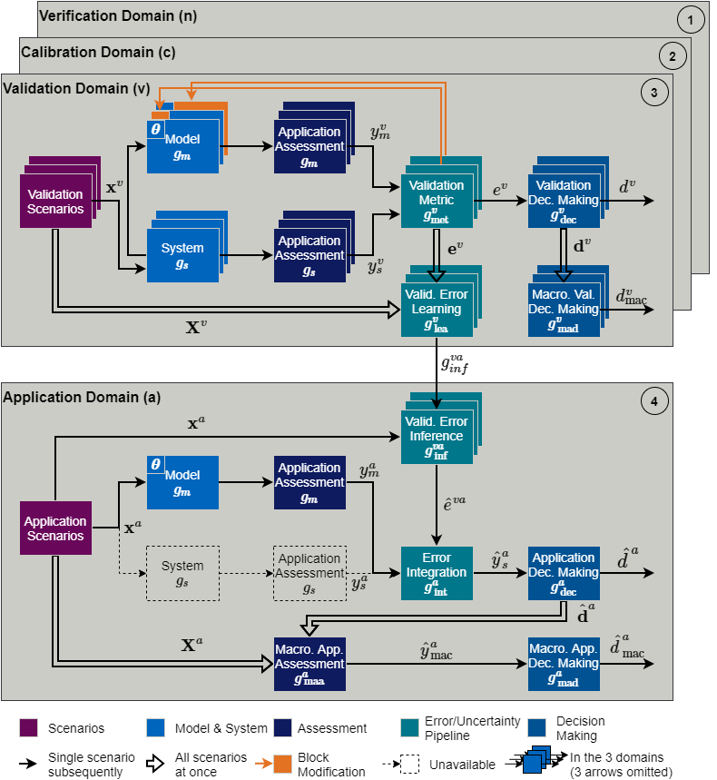

############
Introduction
############
This page describes the fundamentals of the VVUQ framework with a view to implementation.

.. note::
   If an interested user is looking for a deeper theoretical introduction, we refer to the :ref:`Publications <publications>`. They contain a survey of the start of the art, extended methodology, and examplary use cases with several figures.

At the top level within the main script, the number of steps are kept to a minimum:

1. The user provides a configuration file.
2. The config file is used to instantiate a VVUQ class.
3. The process method of the VVUQ object is executed to run through the entire VVUQ process. The attributes of the    object contain all the data afterwards.
4. The VVUQ object and the config file can be forwarded to certain visualization and evaluation functions.

There are currently two main scripts in the root directory. One of them goes through these steps once. The other one goes through them multiple times to compare various validation methods or framework configurations for the specific publication [Riedmaier.2021b]_. The following explanations on this page focus on the VVUQ process in the third step, since it makes sense to start with the actual functionalities of the framework for better understanding.

High-Level Overview
-------------------
We start with giving a short overview about the key parts that make up the framework.

*Figure: Complete VVUQ Framework from Fig. 1 of* [Riedmaier.2021a]_.

Framework Domains
*****************
The framework domains represent central modeling activities. Each of them has in turn one class with one process
method. The VVUQ process method executes the following modeling activities:

1. It starts the model verification process and obtains a numerical uncertainty as result.
2. It starts the model calibration process (not yet implemented).
3. It starts the model validation process and obtains a model-form uncertainty as result.
4. It forwards these uncertainties to the model application process method to consider them during model prediction.

Framework Blocks
****************
Each framework domain contains several framework blocks that represent individual steps of the respective modeling activity. Some of the blocks such as the scenario design or decision making are subject to multiple domains, while other blocks such as the uncertainty integration are unique to a single domain. Each block has one class with one major function, which is the link to the configuration options of the respective block. Therefore, each domain can instantiate a separate class for each of its framework blocks.

.. _framework-manifestations:

Framework Manifestations
************************
We distinguish various manifestations of the framework based on different types of simulation models and experiments affecting multiple framework blocks. This can be done with regards to different aspects.

Regarding (non-)determinisim, we focus on the following types:

1. There are classic deterministic simulations predicting point values.
2. There are experiments with natural variability where repeating the same scenario leads to different results.
3. There are probabilistic simulations that consider uncertainties in form of probability distributions.
4. There are interval simulations that consider uncertainties in form of ranges.
5. There are general non-determinisitc simulations that treat epistemic and aleatory uncertainties separately by a    nested uncertainty propagation with two separate loops. Epistemic uncertainties are represented as intervals,    aleatory uncertainties as probability distributions, and mixed uncertainties as probability-boxes (imprecise    probabilities).

The probabilistic and interval simulations can be interpreted as a degenerate case of the general non-deterministic simulations. These two cases are sometimes implemented in the code but never actually used so far. If this changes, the respective code should be inspected and potentially adapted.

Regarding the time aspect, we assume a dynamic system with time-variant behavior such as an (automated) vehicle. We further assume that the model inputs and parameters are parameterized values as usual for the user interface of many simulation tools. Lastly, we assume that the outputs from the simulation and experiment are time signals, from which key performance indicators will be extracted in post-processing. This behavior could be extended in the future.

With regard to the structure of the system, we assume that we intend to assess the entire system in the experiments and simulations. The code is currently not prepared for validation data of individual subsystems or components and their integration at the system-level in the application domain.

Framework Domains
-----------------
In this section, we take a closer look at the framework domains. The respective code is located in the subfolder src/domains.

Verification Domain
*******************
The verification domain is responsible for quantifiying numerical errors or uncertainties. The process method of the verification class currently executes the following steps:

1. It creates a scenario design with all the parameter combinations that shall be evaluated for the verification task.
2. It executes the scenarios in the simulator.
3. It post-processes the results from the executed scenarios.
4. It quantifies a discretization error via Richardson extrapolation and converts it to a numerical uncertainty.

The scenario design is currently limited to one fixed point of the model inputs and parameters with three variations of the step size parameter from the solver. This stems from the emphasis on the Richardson extrapolation to quantify the discretization error. If further types of numerical errors such as rounding errors are of interest for a new use case, the code of the verification class can be extended.

Calibration Domain
******************
The calibration domain was added to the software architecture, but it is currently not implemented. Inverse calibration methods such as least square, maximum likelihood, or Bayesian calibration could be added in the future to iteratively estimate model parameters from output data.

Validation Domain
*****************
The validation domain is responsible for quantifying model-form errors or uncertainties. The process method of the validation class currently executes the following steps:

1. It creates a scenario design with all the parameter combinations to be executed in the validation experiments.
2. These scenarios shall be executed during the validation experiments.
3. It post-processes the results from the experiments.
4. It creates the corresponding scenario design for the re-simulation of the experiment.
5. It executes the scenarios in the simulator.
6. It post-processes the results from the simulation.
7. It compares the results from simulation and experiments via validation metrics quantifying deviations.
8. It compares the deviations with permissible tolerances to make an early decision on the model quality.
9. It learns a data-driven meta-model of the deviations to preserve the error knowledge across the scenario space.
10. It compares the results from the experiments and re-simulations with the safety regulation of the application to     make an early decision on the safety of the system.

Application Domain
******************
The actual model predictions take place in the application domain. The process method of the application class obtains the numerical uncertainty from the verification and the data-driven error model from the validation. Then, it runs through the following steps:

1. It creates a scenario design for the model predictions.
2. It executes the scenarios in the simulator.
3. It post-processes the results from the simulation.
4. It infers the model-form uncertainties from the validation to the application scenarios by means of the meta-model.
5. It integrates the numerical and model-form uncertainties into the simulation results to account for them and to
   estimate the true, unknown results from reality.
6. It compares the estimated results with the safety regulation to decide on the system safety.
7. It compares the nominal simulation results with the safety regulation as the normal baseline.

The application domain often only contains model predictions to legitimize the model-based process. If many experiments would be exectued in the application domain, then there is little need for the simulation in the approval process, since the experimental results should be taken directly. Nevertheless, there are a few cases where experiments in the application domain are useful.

.. note::
   Sometimes a limited set of application scenarios has to be executed in the real world if the model quality is not sufficient in subsets of the scenario space. However, this is not yet part of this framework, since it does not build on the model-based VVUQ process.

Another case is the validation of the VVUQ framework itself. This requires ground truth data in the application domain to judge whether the estimations from the VVUQ process realistically account for the model uncertainties and lie close to the true values. Therefore, it is possible to set a ground truth flag in the config to activate an additional pipeline for the experiments:

8. It creates the corresponding scenario design for the experiment.
9. These scenarios shall be executed during the experiments.
10. It post-processes the results from the experiments.
11. It compares the experimental results with the safety regulation as the ground truth.

Framework Blocks
----------------
In this section, we take a closer look at the individual framework blocks. The respective code is located in the subfolder src/blocks. If a specific block offers a variety of techniques or is quite complex, the details are outsourced into separate modules in the subfolder src/variants. The configuration of each block is handled via a config file, which is specified by the user. More information can be found at the :doc:`../2_user/config`. The class of each block contains one major method (or sometimes two) that is called on the level of the framework domains and handles the internal processing pipeline with the call of further methods depending on the user selections. The following explanations focus mainly on the most important tasks of each major method to convey the principles.

Scenario Design
***************
The scenario class is responsible for the design of the tests that will be executed in experiments or simulations. It is targeted for both the experiment and the simulation. The verification and application domain usually contain only a simulation, while the validation domain contains an experiment followed by a re-simulation. Therefore, the scenario class distinguishes between the first method call where the scenarios are generated from scratch and the second method call where the scenarios from the previous experiment are re-used for a subsequent re-simulation.

.. note::
   We currently use the ideal values from the intial scenario design also for the re-simulation. This is not a strict re-simulation in the sense of measuring the actual input quantities/signals and re-simulating them. This is planned for the future but requires a larger extension due to the simulator control.

Independent on the framework manifestation, it starts with the generation of scenarios across the scenario space. The corresponding scenario parameters with their range and the sampling technique are selected by the user in the config file. Examples are latin hypercube or Monte Carlo sampling. In the case of non-determinism, further loops are added to the sampling in order to obtain local samples around each nominal scenario. Experimental repetitions add one additional loop, while the separate sampling of epistemic and aleatory parameters adds two more loops. The type and size of the uncertainties and the respective sampling technique can be configured again. At the end, the scenario object provides a scenario array, whose dimension depends on the framework manifestation.

Simulator
*********
The simulator class is responsible for the entire simulation handling and covers the handling of recordings from simulations and experiments as a common subset. In the case of a simulation, it automatically executes the entire scenario array by fully controlling the simulation tool. Currently the simulation tool IPG CarMaker is supported and handled by means of a designated class. This class provides various services such as setting up a (TCP/IP) connection, configuring the simulator settings (via a Tcl language), and sending the parameter values and result storage paths. The tool-dependent mechanisms are encapsulated in this separate class.

.. note::
   New simulation tools can be added in the future by implementing new classes that must provide the same services but can use different mechanisms inside.

Afterwards the recordings are loaded. The software currently supports the erg file format from CarMaker and the MF4 file format often used in vehicle experiments. The parsers are located in the subfolder src/helpers. To ensure a consistent interface, a generic DataFileReader parent class is implemented, from which the child class of a respective file format has to inherit and overload certain methods. The file readers extract desired quantities specified by the user and convert the raw data into mandatory data structures. The simulator class uses a separate namespace handler class, since various measurement systems and simulation tools use various naming conventions. If new quantities or tools are added, the namespace dictionaries have to be extended once. The resulting namespace is currently based on the CarMaker naming convention.

.. note::
   Further functionalities such as unit conversions are partly considered in the software architecture, but they have to be implemented in the future.

Assessment
**********
The assessment class contains the whole post-processing of the data. It is the same for all test environments across all domains to ensure the same treatment of the simulation and experiment for comparability and to ensure alignment of the domains towards the actual use case. The assessment is heavily dependent on the specific application. Therefore, parts of the assessment class will only be relevant to the automated vehicle application. Nevertheless, the application class also contains some usual tasks:

1. It offers filtering of noisy signals.
2. It computes quantities of interest, which cannot be directly measured, from other measurement quantities. An example    would be a time-to-collision, if only the velocities and positions of the vehicles are available from IMUs.
3. Then, there is a specific section for the processing according to the UNECE regulation 79 for lane keeping. It    contains a subsection with all tasks used for the publications. In addition, there was the idea to explore a fully    data-driven handling of the scenario inputs, where the concrete scenarios are extracted from random field recordings    instead of planning them in advance. This is, however, not fully implemented.
4. It offers the calculation of key performance indicators or characteristic values from the time signals. Examples are    minima or maxima.
5. Finally, it creates certain data structures that are required for the framework manifestations. This includes CDFs    for purely aleatory uncertainties and p-boxes for mixed uncertainties.

Metric
*****************
The metric class offers mathematical metrics as distance operators. There are several categories of metrics that must be aligned to the respective framework manifestation:

1. Metrics such as the absolute and relative deviations between scalar deterministic values.
2. Metrics such as the RMSE between time vectors. They are implemented but not used during the publications, since we    extracted characterisitic values from the time signals in advance during the assessment.
3. Metrics such as the area metric between probability distributions or p-boxes in general.

Metrics that quantify a deterministic model-form error yield a single scalar value per quantity of interest. Metrics that quantify a epistemic model-form uncertainty yield a interval with two interval boundaries per quantity.

There are variety of metrics available. Some are widely known, others come specifically from validation metrics. Divergences or classic hypotheses tests could be added, but these must be handled with care and often should not be used. Divergences such as the Kullback-Leibler divergence that is infamous from machine learning does not satisfy the symmetry axiom of a mathemical metric. This would mean that the distance from the simulation to the experiment is not the same as from the experiment to the simulation. The classic hypotheses tests yield binary results loosing information.

Error Learning and Inference
****************************
The training and inference of the data-driven error model is covered by the same class so that the error model itself can be shared as attribute of the class. During the training part, the validation scenarios are provided as inputs to the meta-model and the model-form errors from the validation metric are provided as desired outputs. After the training, the meta-model should imitate this input-output behavior well. During the inference part, the application scenarios are provided as inputs and the meta-model predicts or estimates the model-form errors. The error model class contains a loop to train and infer a separate model for each quantity and for both interval boundaries in case of an epistemic model-form uncertainty. There are a variety of meta-modeling techniques available. The focus in the publications was on the linear regression with external prediction intervals to cover both the uncertainty of the meta-model itself and the prediction to new scenarios. There are already further techniques such as polynomial regression, Gaussian process regression, or multi-layer perceptrons implemented. However, these implementations have to be finished entirely and tested to start a comparison of different technqiues.

Error Integration
*****************
The error integration class has the task to consider the modeling errors and uncertainties before the final decision making. It basically offers two techniques. The bias correction uses the deterministic errors to correct the nominal model predictions. This exploits the knowledge but is risky. The uncertainty expansion uses the errors or uncertainties to expand the nominal model predictions. This yields either interval-valued outputs or generally p-boxes. This technique adds additional conservatism to increase the statistiscal guarantees of decision making.

Decision Making
***************
The decision making class offers two separate methods for the validation and application domain. The validation decision making deals with the model-form errors or uncertainties. It checks whether these values or intervals lie within permissible tolerances specified by the user. This yields binary decisions with the states valid and invalid for each validation scenario. The application decision making deals with the safety of the processed model predictions. These can be either deterministic values, epistemic intervals, or p-boxes. In case of the latter, the user can specify a confidence that takes the steps of the CDF edges into account. They are then compared with either a lower threshold, an upper threshold, or both. This yields binary decisions with the states safe and unsafe for each application scenario. The entire system is usually considered safe if all indidvidual decisions are safe.

