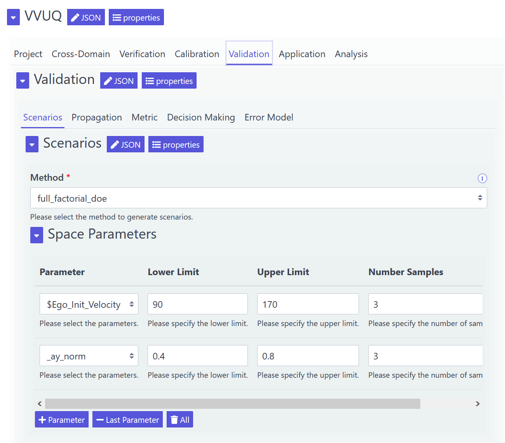

=============
Configuration
=============
This page targets the configuration of the VVUQ framework by the user.

Json Schema Definition, Config Files, and UI Form
-------------------------------------------------
We use external configuration files to keep the software and its configuration separate. We select json files, but other formats with a Python package work as well, since the config will be represented as a dictionary in the code anyway. From a human perspective, json has some disadvantages as config files, since it is designed for serializers, has no comments, and is a bit cumbersome to create with all the curly braces. However, it has a large community and is the basis for json schema definitions. They can be used both for schema validation and form generators. Within our code, we compare the config against the schema to validate the user inputs. In addition, we can optionally apply a tool to generate a UI form from the schema that visually helps the user to fill out the config form and preemptively avoids wrong user inputs.

There are a couple of web-based UI form generators available. An overview can be found `here <https://json-schema.org/implementations.html#web-ui-generation>`_. We currently use the `json editor <https://github.com/json-editor/json-editor>`_. It provides an `interactive demo <https://json-editor.github.io/json-editor/>`_ and an `interactive playground <https://pmk65.github.io/jedemov2/dist/demo.html>`_ online. It can also be accessed offline by cloning or downloading their git repository and opening the index.html file from their docs folder with a browser of choice. We selected it primarily due to its compact UI based on tabs. Otherwise, the handling of the large config would be extremly cumbersome. It offers basic dependencies and allows to provide short infos to the user visualized in the UI that replace comments in the config files.

.. note::
   However, the json-editor only fully supports the old schema versions 3 and 4, the schema and UI are in the same file, and the dependency options are tool-specific but yet limited. This means that newer features such as if-else-constructs are ignored so that we had to implement the dependent requirements checks both in the new syntax for our schema validations in the code and in the tool-specific syntax for the web-form. In the future, it might be interesting to switch to the `react implementation <https://github.com/rjsf-team/react-jsonschema-form/tree/master>`_, after they add support for `multiple pages <https://github.com/rjsf-team/react-jsonschema-form/issues/1157>`_.

The json editor offers the following key user interactions:

1. The user inputs the json schema definition and clicks on the 'Update Schema' button. This loads the UI form with the    default settings from the schema definition.
2. The user selects the desired configuration options in the UI form. These are automatically converted to the json config and visualized as well so that the user can download them. Alternatively, the user can go in the inverse direction by uploading a json config and by clicking on the 'Update Form' button. Then, the UI form is updated with the data from the config. This is helpful if the user already has a config and wants to inspect it visually or wants to change only a few settings with the help of the UI.
3. The validity of the user inputs is automatically checked in the background against the schema definition and highlighted for the user.
4. The user can select major CSS frameworks such as Bootstrap that alter the view of the UI form.

Config Handling
---------------

The config files of our VVUQ framework are located in the configs folder. This is true for both the json schema definition named vvuq_schema.json and various json config files named vvuq_config_*.json. Their content can be inputed into the json editor and altered as described above. Various configs previously used are included to showcase exemplary configurations. They must all be seen as alternatives, since there is only one config file per VVUQ object. In addition, there can be a few exceptional json config files that aim at application-specific settings, which are only relevant for one application assessment and would overload the main config.

There is a central config handler that processes the config file in the following steps:

1. Validate config against schema
2. Extend config to derive new keys or generate new data structures better suited for the code
3. Perform further validations in the code that go beyond the schema capabilities

.. warning:: The options for the user are comprehensive and they have many dependencies among each other. For example, selecting parameters with uncertainties requires also selecting a validation metric such as the area metric that can handle the resulting outputs. There is a lot of flexibility for novel combinations but also a lot of knowledge required. The UI form already intends to prevent wrong user inputs by means of the json schema definition and we implemented a central config handler with additional validations. Nevertheless, this software stems from a PhD thesis and there was yet not enough time to foresee and add all (cross-)validations. There are definitely chances that a user inputs an invalid combination of settings.

UI Form Structure
-----------------
Each major section from the config is mapped to a tab in the UI Form. The highest level primarily aims at the framework domains. There are cross-sections with global settings affecting several domains and domain-specific sections. Each section/tab can have subsections/subtabs that primarily aim at the framework blocks. The figure demonstrates an exemplary configuration of the scenarios in the validation domain.

*Figure: VVUQ framework configuration in the json-editor form.*

Config Keys
-----------
We directly added the description of each config key to the schema definition so that it will be visualized in the form itself and it is as easy as possible for the user to fill out the form. Consequently, we excluded the description of the config keys from this documentation here so that the user does not have to switch between the form and the docs. We added a short description below each form element, while we added more detailed infos for complex config options when hovering with the mouse over the form element.
